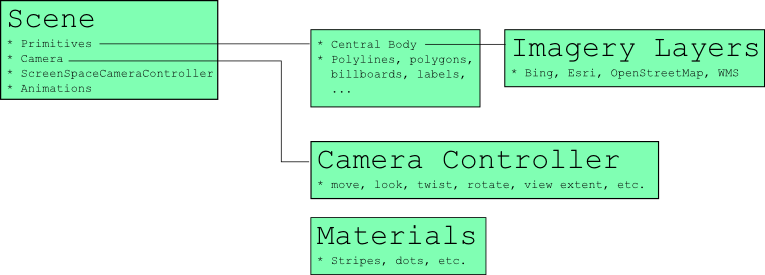

# CesiumJS 구조
CesiumJS는 크게 다음과 같은 구성 요소로 이루어져 있습니다.

## 1. Core
CesiumJS의 핵심 라이브러리입니다.
Core는 Cesium에서 가장 낮은 계층이며 주로 수학과 관련된 low-level의 널리 사용되는 기능을 포함합니다
 - 행렬, 벡터 및 쿼터니언.
 - Transformations, such as cartographic to Cartesian.
 - Mercator 및 Equidistant Cylindrical과 같은 지도 투영법.
 - 태양 위치.
 - 줄리안 데이트.
 - 위치 및 방향을 보간하기 위한 스플라인.
 - 삼각 측량, 세분 표면, 정점 캐시 최적화, 타원 경계점 계산과 같은 기하학적 루틴.

## 2. Widgets
사용자 인터페이스 요소를 만드는 데 사용되는 모듈입니다. 2D/3D 뷰어, 시계, 슬라이더, 위치 선택 도구 등의 위젯을 제공합니다.

## 3. DataSources
CesiumJS에서 사용하는 데이터를 로드하고 표시하기 위한 모듈입니다. 다양한 데이터 형식을 지원합니다.
 ### CZML 
 > CesiumJS의 JSON 형식인 CZML을 사용하여 시간에 따른 데이터를 시각화합니다.
 ### GeoJSON 
 > 지리적 특징을 표시하는 데 사용되는 GeoJSON을 사용하여 데이터를 시각화합니다.
 ### KML 
 > 구글 Earth에서 사용되는 KML을 사용하여 데이터를 시각화합니다.
 ### TopoJSON 
 > TopoJSON 형식을 사용하여 지리적 경계 및 특징을 시각화합니다.

## 4. Terrain
지형 데이터를 생성하고 표시하는 데 사용되는 모듈입니다. 다양한 지형 데이터 소스를 지원합니다.

## 5. Scene
3D 그래픽 엔진입니다. 실제 지형, 엔티티 및 모델을 렌더링하고 사용자 이벤트 처리 등을 담당합니다. 
이 모듈은 WebGL 렌더링 컨텍스트를 생성하고, 사용자 입력 및 기타 이벤트 처리, 뷰 포인트 및 카메라 제어 등을 담당합니다. 
Scene 객체는 Viewer 객체의 일부분이며, Viewer 객체를 생성할 때 Scene 객체가 자동으로 생성됩니다.

### 렌더링
 >Scene 객체는 WebGL을 사용하여 지형, 엔티티, 모델 등을 렌더링합니다.  
 Scene 객체는 이 API를 사용하여 3D 지도를 생성하고 렌더링합니다.

### 뷰 포인트 및 카메라 제어
 > Scene 객체는 뷰 포인트 및 카메라 제어를 담당합니다.  
 사용자는 마우스와 키보드 등을 사용하여 지도의 위치, 방향 및 줌 레벨 등을 변경할 수 있습니다.  
 이러한 기능을 사용하여 사용자는 지형과 엔티티를 쉽게 탐색하고, 분석할 수 있습니다.

 
##  6. Third-Party
CesiumJS에서 사용하는 다양한 서드파티 라이브러리입니다.  예를 들면, Tween.js와 같은 애니메이션 라이브러리, moment.js와 같은 시간 관련 라이브러리 등이 있습니다.
